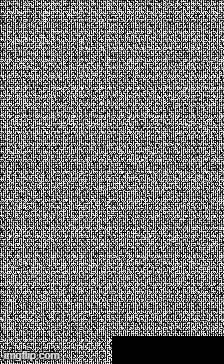

# Pytorch深度學習框架X NVIDIA JetsonNano應用-cDCGAN生成手寫數字

| 作者 | Chia-Chun, Chang |
| ---- | ---|
| 所屬單位  | Cavedu 教育團隊 |
| 開發日期  | 10909 |
| 文章連結  | https://www.rs-online.com/designspark/pytorchx-nvidia-jetsonnano-cdcgan-cn |

___

## 介紹
之前曾經使用過dcgan來生成手寫數字圖像，但是因為是隨機生成的效果無法控制，所以後續有了cdcgan的出現，前面多了一個c代表的是Condition的意思，加入了條件的生成對抗網路讓我們可以選擇要生成的數字是哪一個。

